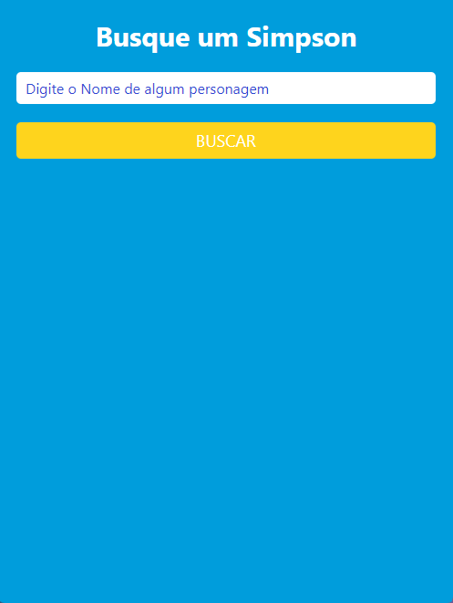
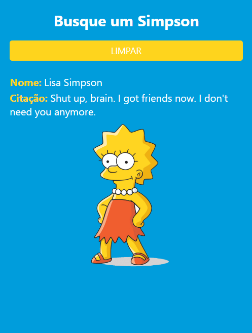

# React Native API 

Esta API foi feita para cadeira de Programação Mobile da faculdade.  

 

| Inicialmente você precisa digitar o nome do personagem que deseja encontrar: 

 

| Ao clicar em "buscar" irá aparecer para você algumas informações do personagem: 

 

| Esta API consome dados da API Pública [ The Simpsons Quote API ](https://thesimpsonsquoteapi.glitch.me)

Para ativa-la, baixe o repositório e dentro da pasta dê os seguintes comandos: 

<code> npm install </code>

<code> npm install axios  </code>

Para rodar a aplicação: 

<code> npx expo start </code>

